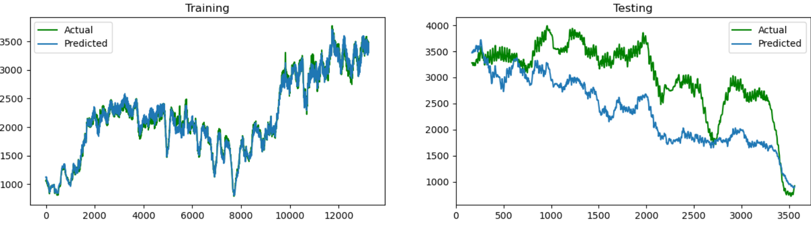

# Task 2: End-to-end Machine Learning Pipeline (MLP)


The following files and their functionality have been described below:

**run.sh file:**
For running the Python script `main.py` in command line


**main.py file:**
Contains the wrapper functions of the different models and contains the main logic to create the training model and to perform forecasting.

**utils.py file:**
Contains of several helper function such as preprocessing function, hyperparameter tuning and several adhocs function to serve the main functionality of `mlp.py` file.

**hyperparams.py file:**
A constant file that stores the hyperparameters value that needs to be search for when calling the hyperparameter tuning function in the `utils.py` file. The hyperparameter values in variable `best_params_rfr` and `best_params_xgbr` can be changed to process the model differently.


**config.py file:**
A config file that allows configuration of the following variables
- `url`: The url to be fetched from the server.
- `list_features`: Selecting the features to be included for the actual preprocessing and training of the model
- `peak_hours`: The default selected peak hours (Can be changed)
- `train_size`: Change the training size 


## Pipeline design ## 
The pipeline design consists of the following steps. Since initial analysis on the features has been done in Task 1 EDA.
- Preprocessing of the dataset (Including creating additional feature and normalizes the data.)
- Splits the dataset into trainset ratio of **80:20** (Can be configure in `config.py`).
- During preprocessing, additional configuration of the peak hours can be manually selected by the user. Given my experiments during the model selection, I've found out that selecting the right peak hour gives us significant drop of RMSE on the test set (Including all the moving averages). The default and optimal peak hours is `[7,8,17,18,19]` analysed from Task 1 EDA visualizations.
- Fitting the preprocessed dataset into our algorithms of choice.
   - RandomForestRegressor
   - XGBoostRegerssor
   - Ensemble (RandomForestRegressor + XGBoostRegressor)
- Perform forecasting on the remaining 20% test set.
- Returning the evaluation metric in **RMSE**.

## Algorithms choice ##
Three regression algorithms has been considered, since the problem at hand is a regression task (Forecasting) . Hence, I've chosen the RandomForestRegressor and XGBoostRegressor and a final ensemble model which is nothing but a combination of both RandomForestRegressor and XGBoostRegressor which should ultimately gives us a better score.

### Hyperparameters for both Model ###
Several hyperparameters configurations are stored in `hyperparams.py` file. The following are the final hyperparameters found by RandomizedSearchCV. The train test split are always **80:20** ratio.

#### RandomForestRegressor hyperparameters ####
`'n_estimators':` **1000** <br>`'min_samples_split':` 5<br>`'min_samples_leaf':` 10<br>`'max_features':` 'auto'<br>`'max_depth':`  **50**<br>`'criterion':` 'mse<br>`'bootstrap':` True<br>
 
Took **53.64** seconds for **1000** trees and a depth of **50**<br>Train RMSE:**773.0876**<br>Test RMSE: **1730.0279**<br>
 
In addition, an alternative set of hyperparameters has been found by extrapolating the search from the hyperparameters found in RandomizedSearchCV by manual trial and error. This reduced the training computational speed by **10x** yet with a competitive <b>RMSE</b>.

`'n_estimators':` **100**<br>`'min_samples_split':` 5<br>`'min_samples_leaf':` 10<br>`'max_features':` 'auto'<br>`'max_depth':`  **30**<br>`'criterion':` 'mse<br>`'bootstrap':` True<br>
 
Took only **5.37** seconds!<br>Train RMSE: **775.0954**<br>Test RMSE: **1731.0579**<br>

 
 
 #### XGBoostRegressor hyperparameters ####
`'n_estimators':` **700**,<br>`'min_child_weight':` 1,<br>`'max_depth':` **90**,<br>`'learning_rate':` 0.05,<br>`'gamma':` 0.4,<br>`'colsample_bytree':` 0.7,<br>`'alpha':` 3<br>
 
 Took **37.48** seconds for **700** trees and a depth of **90**<br>X_train: **0.4284**<br>X_test: **2004.3382**<br>

Similarly extrapolating has been done for the XGBoostRegressor as well. This reduced the training computational speed by **10x** yet significantly reduces the overall <b>RMSE</b>.
`'n_estimators':` **100**,<br> `'min_child_weight':` 5,<br> `'max_depth':` **30**,<br>`'learning_rate':` 0.08,<br>`'gamma':` 0.4,<br> `'colsample_bytree':` 0.8,<br>`'alpha':` 3<br>
 
Took **3.29** seconds for **100** trees and a depth of **30**<br>X_train: **52.2658**<br>X_test: **1845.5027**<br>

### Ensemble Model (RandomForestRegressor + XGBoostRegressor) ###
  Took **9.0** seconds to run both models with the above optimal hyperparameters.

Ensemble Model (RandomForestRegressor + XGBoostRegressor)
Evaluation metric: RMSE
X_train: **405.2272**
X_test: **1758.3363**

And the following graph shows the forecasted result from the 1000th row onwards in the train set and display all forecasted values from the test set.



Given the visualizion on the above forecasted test set (Second graph), we can see the forecasted trend (blue) are somehow identical to the original trend (green) but with a large error on rapid changes at various occasions. Given the analysis on EDA 'total number of active users' are always increasing with time, hence the model have a hard time matching the sudden change, neverthless the weekly patterns are captured.


 

## Running of the program ##
I've create a few options for the Machine Learning Pipeline where it allows you to 
1. (Pipeline 1) Preprocess and train the dataset with best parameters and features
2. (Pipeline 2) Preprocess and train the dataset with your specify peak hours e.g. `7,8,17,18,19`
3. View all evaluation metric
4. Visualize the forecasted data in graph
5. Quit


#### To run the program ####
- In Windows (The following commands are run in command prompt)
    > run.sh

The following are the sequence of the program when being run **(The program will keep looping until the user select option 5. Quit)**

The following bash will perform forecasting using the best parameters and features with the RandomForestRegressor model using Pipeline 1.
```bash
##################   Task 2 Machine Learning Pipeline   ##################
Downloading dataset...
Please select an option
1. (Pipeline 1) Preprocess and train the dataset with best parameters and features
2. (Pipeline 2) Preprocess and train the dataset with your specify peak hours e.g. 7,8,17,18,19
3. View all evaluation metric
4. Visualize the forecasted data in graph
5. Quit

Selection Option: 1

Select the model
1. RandomForestRegressor
2. XGBoostRegressor
3. Ensemble Model (RandomForestRegressor + XGBoostRegerssor)
4. Back

Selection Option: 1
--- Started training on the RandomForestRegressor model ---
--- Finished training the RandomForestRegressor in 5.44 seconds ---
RandomForestRegressor
Evaluation metric: RMSE
X_train: 775.0954
X_test: 1731.0579
```
The following bash will perform forecasting using the peak hours keyed in by users with the XGBoostRegressor model using Pipeline 2.
```bash
##################   Task 2 Machine Learning Pipeline   ##################

Please select an option
1. (Pipeline 1) Preprocess and train the dataset with best parameters and features
2. (Pipeline 2) Preprocess and train the dataset with your specify peak hours e.g. 7,8,17,18,19
3. View all evaluation metric
4. Visualize the forecasted data in graph
5. Quit

Selection Option: 2
Enter the number of peak hours e.g. 7 8 9 separated by space: 11 12

Select the model
1. RandomForestRegressor
2. XGBoostRegressor
3. Ensemble Model (RandomForestRegressor + XGBoostRegerssor)
4. Back

Selection Option: 2
--- Started training on the XGBoostRegressor model ---
--- Finished training the XGBoostRegressor model in 3.65 seconds ---
XGBoostRegressor
Evaluation metric: RMSE
X_train: 82.7142
X_test: 2400.8631
```

After the above Pipeline (1) and Pipeline(2) has been run, the metric and forecasted data will be stored and the user can select the option **3. View all evaluation metric** or **4. Visualize the forecasted data in graph**
```bash
##################   Task 2 Machine Learning Pipeline   ##################

Please select an option
1. (Pipeline 1) Preprocess and train the dataset with best parameters and features
2. (Pipeline 2) Preprocess and train the dataset with your specify peak hours e.g. 7,8,17,18,19
3. View all evaluation metric
4. Visualize the forecasted data in graph
5. Quit

Selection Option: 3
RandomForestRegressor with Peak hours: [7, 8, 17, 18, 19] | Train RMSE: 775.0954 | Test RMSE: 1731.0579
XGBoostRegressor with Peak hours: [11, 12] | Train RMSE: 82.7142 | Test RMSE: 2400.8631

##################   Task 2 Machine Learning Pipeline   ##################

Please select an option
1. (Pipeline 1) Preprocess and train the dataset with best parameters and features
2. (Pipeline 2) Preprocess and train the dataset with your specify peak hours e.g. 7,8,17,18,19
3. View all evaluation metric
4. Visualize the forecasted data in graph
5. Quit

Selection Option: 4
Select the option to visualize the graph
1. RandomForestRegressor with Peak hours: [7, 8, 17, 18, 19] | Train RMSE: 775.0954 | Test RMSE: 1731.0579
2. XGBoostRegressor with Peak hours: [11, 12] | Train RMSE: 82.7142 | Test RMSE: 2400.8631
3. Back

Selection Option: 1
```
After selecting Option 1, a plot of the forecasted data will be pop up.


## Conclusion ##
Initially ARIMA model was considered as the predictive model for forecasting in this dataset. However after some readings on timeseries, ARIMA was found to be a univariate model which does not model the relationship with other variables which might be important for this dataset. Hence, we have only check for stationarity in this dataset to factor in the moving averages calculated from the target variable "total number of active users". 

Hyperparameter tuning function `hyperparameter_tuning()` has been implemented in the file `utils.py` to search for the optimal hyperparameters, but it is not used in the pipeline as searching takes considerable amount of time given the search space in `hyperparams.py`.

Helper function `perform_kfold()` has also been implemented in the file `utils.py` to train on multiple training splits. Experiments was conducted and found out that the results is not promising, since the future data we are going to predict won't be useful as future data (Total number of active users) is always increasing with time.

